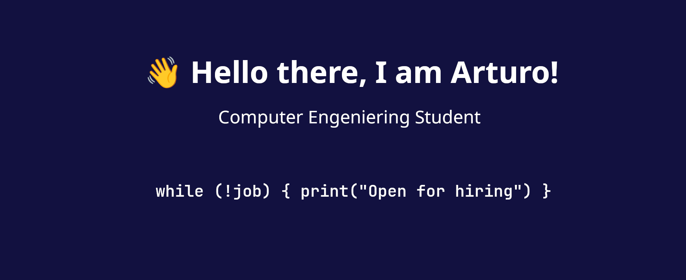

  

<h4 align="center"> <i>Open for hiring</i> </h4>

<h3 align="center"> 💲 whoami </h3>
  

    ✨ <i><b>I am a simple developer, making my way through the IT world</b></i> ✨   
    Also I'm the type of guy who never gives up on anything, no matter how many sacrifices or time I have to make up to acomplish   something.  
    Currently, I am on my third year of Computer Engeniering, <i>loving it so far, </i> <!-- excepto por la pedazo de mierda de asignatura que es CSD --> with a strong determination of becoming a Cibersecurity Engenieer, since it has been my passion for as long as I can remember
  

---

<h3 align="center">👨🏻‍💻 I worked with </h3>
  

    
    
    
    
     <!-- sorry Abdel, te lo robé :) -->
    
    
    
    
    
    
    
    
    
     
  

 

---

<h3 align="center"> Like what you see? Contact me! </h3>
  

    
    
  

---

<h3 align="center"> ⬇️ Check out my repos! ⬇️ </h3>
